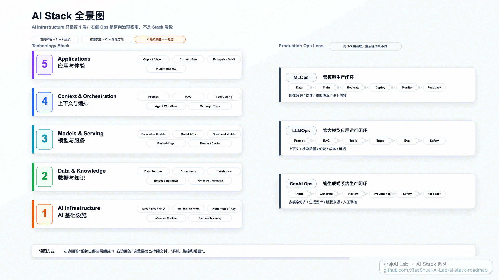

# AI Stack Roadmap

[English](./README.en.md)

这里是 **小帅AI Lab** 的 AI Stack 系列资料库。

这个系列想回答一个很朴素的问题：

> 一个 AI 能力从 Demo 走到真实生产环境，中间到底要经过哪些系统、平台和工程环节？

我会尽量少堆名词，多沿着真实链路讲清楚：应用怎么接模型，RAG 和 Agent 怎么进入系统，评测、监控、成本、数据和 AI 基础设施又分别在什么位置发挥作用。



## 主要入口

| 平台 | 链接 |
| --- | --- |
| B站 | <https://space.bilibili.com/3706976575949152> |
| YouTube | <https://www.youtube.com/channel/UCHl0Kfu83gyLGFeIW3YuAqg> |
| GitHub | <https://github.com/XiaoShuai-AI-Lab/ai-stack-roadmap> |
| Email | <xiaoshuai.ai.lab@gmail.com> |

## 最新一期

| 期数 | 主题 | 资料 |
| --- | --- | --- |
| 001 | [MLOps -> LLMOps -> GenAIOps](./episodes/001-mlops-llmops-genaiops/README.md) | [PDF](./episodes/001-mlops-llmops-genaiops/ai-stack-001-mlops-llmops-genaiops.pdf) · [References](./episodes/001-mlops-llmops-genaiops/references.md) |

这一期主要讲三代 AI 工程化方法的演进：

```text
MLOps
  管模型生产：数据、训练、评测、部署、监控、回流

LLMOps
  管大模型应用运行：Prompt、RAG、工具、Trace、评测、成本

GenAIOps
  管生成式系统生产：多模态、Agent、生成资产、安全、治理、反馈
```

核心观点是：

> 从 MLOps 到 LLMOps，再到 GenAIOps，变化的不只是名字，而是工程体系要管理的对象越来越宽。

## 怎么使用这个仓库

建议按这个顺序看：

1. 先看视频，建立整体感觉。
2. 再看本期 PDF，快速复习主线。
3. 如果想查证来源，看本期 `references.md`。
4. 如果只想抓大图，可以先看上面的 AI Stack 主图。

## 系列规划

这个仓库会跟着视频一起慢慢长出来。第一阶段先保持轻量，每期只沉淀最有用的公开资料：

```text
episodes/
  001-mlops-llmops-genaiops/
    README.md
    ai-stack-001-mlops-llmops-genaiops.pdf
    ai-stack-overview.png
    references.md
```

后面如果内容多起来，再增加路线图、专题图、英文字幕、文章版讲义等内容。现在先不把结构做重，先让每一期资料都好找、好读、好引用。

## 关于小帅AI Lab

小帅AI Lab 关注 AI 工程化、AI 平台、Agent / RAG / Workflow、模型服务、评测、可观测性、数据与 AI Infra。

不聊虚的，尽量把 AI 落地背后的真实工程世界讲清楚。
